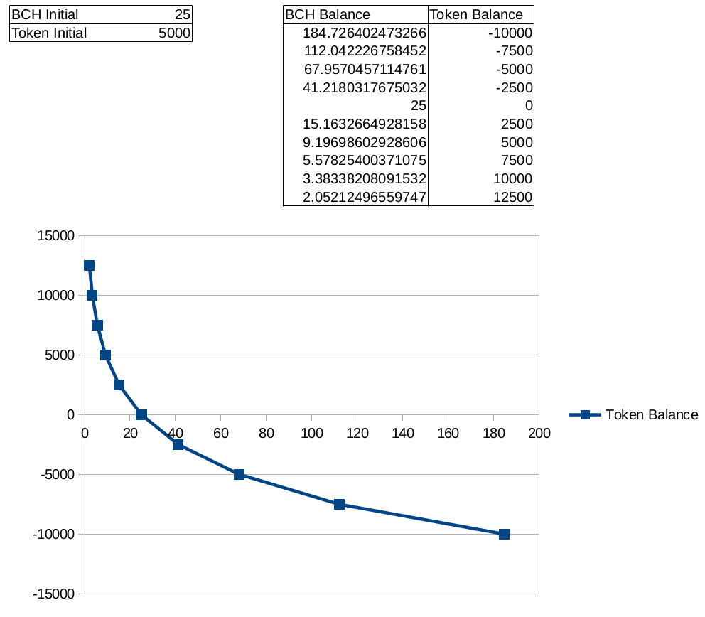

*This post walks through the math and architectural decisions behind the [token-liquidty app](https://github.com/Permissionless-Software-Foundation/token-liquidity) used by the [Permissionless Software Foundation](https://psfoundation.cash/). The app is an automated market-maker that allows for permissionless trading between a token and Bitcoin Cash. Send it tokens, it sends you BCH. Send it BCH, it sends you tokens. That's how it works.*

*The mathematics built into the app represent an attempt to create a community-based pseudo-stable token for rewarding and incentivizing developers that contribute to the Foundation's open source software projects.*

## Overview
The [token-liquidty app](https://github.com/Permissionless-Software-Foundation/token-liquidity) is a JavaScript application written in node.js which is inspired by the [Bancor whitepaper](https://github.com/Permissionless-Software-Foundation/token-liquidity/blob/master/docs/bancor-formulas/bancor-protocol-whitepaper.pdf) and the ideas of creating community-based currency as explored [in this video](https://youtu.be/LcbHTF3zCdI). It's an automated, permissionless market-maker which allows a community token to achieve perfect liquidity between itself and Bitcoin Cash.

The mathematics behind the smart-contract described in Bancor's whitepaper were manipulated and adjusted to create a similar but new type of automated market-maker. The app constantly adjusts its exchange rate in order to provide 'guard rails' against market panics and irrational exuberance. The price of the token is still subject to free-market supply and demand, but it is strongly encouraged to fluctuate within a psudo-stable range of prices.

In this way, the app makes it easy for the community to manage the value and stability of their token.

## The Base Equation

The basic equation controlling the exchange rate of the application is based on the natural logarithm:

The basic equation above governs the balance of token-liquidity app. The app will constantly adjust its exchange rate in order to maintain a balance of tokens and BCH governed by the equation above. This equation has several advantageous properties:

- The BCH never goes to zero. As more tokens are added to the app, the exchange rate is adjusted so that the total amount of BCH can never extracted. The app can never run out of BCH.  

- It's easy to control the exponential price increase by creating new tokens and sending them to the app. This lowers the price and allows the community to capture BCH for funding.  

- There is a psudo-stable range to which the app will naturally gravitate. This is expressed in the -5000 to 5000 range in the graph above, but this range is adjustable by setting the initial values of the equation.

The major features of the curve are determined by the initial values of BCH and tokens. In the example above the initial values are 25 BCH and 5000 tokens. This is not the initial state of the app, they are simply constants that determine important features like the psuedo-stable range of token balances and the point where the equation crosses the y-axis.

The initial values do create a constant (unchanging) value relationship between the token and the underlying asset (Bitcoin Cash). In the example above, 5000 tokens / 25 BCH creates a relationship of 200 tokens per BCH. This is the point where the equation crosses the y-axis.

When the token is near its psudo-stable point, 200 tokens will be exchangeable for 1 BCH. While the fiat value of BCH is free to change, this relationship between tokens and BCH will remain constant. It provides a basis upon which workers can value their time (in terms of tokens) relative to their market price in their local fiat economy.

## Implementation
Implementing this basic math into an automatic market-making app consists of the following steps:

1. Calculate the state of the app, based on its current BCH or token balance.  
2. Calculate the state of the app based on the new input from the user(BCH or tokens).  
3. Calculate the difference between the two states. Distribute the difference to the user.

## Step 1: Calculating state based on BCH
The basic equation is helpful for conceptualization, and comparing to the Bancor whitepaper. But the axis needs to be swapped, since BCH is the finite resource, whereas tokens can be created and destroyed at-will by the governance of the community.

## Step 2a: BCH In
If the user sent in BCH, this step calculates the new balances and determines how many tokens to send back in exchange for the BCH.

- Initial balances are known: `bch1`
- The initial token balance can be calculated from *bch1*: `token1`
- Input BCH is known: `bchIn`
- Solve for token output: `tokenOut`

## Step 2b: Tokens In
If the user sent in tokens, this step calculates the new balances and determines how much BCH to send to the the user. The math takes a little twist here. The 'original calculation' would determine the BCH to send based on the token balance. However, to combat transaction noise and knowing that BCH is the *real* finite resource, the 'BCH-based calculation' achieves the same result, and the implementation is based on the actual (rather than calculated) BCH balance of the app.

