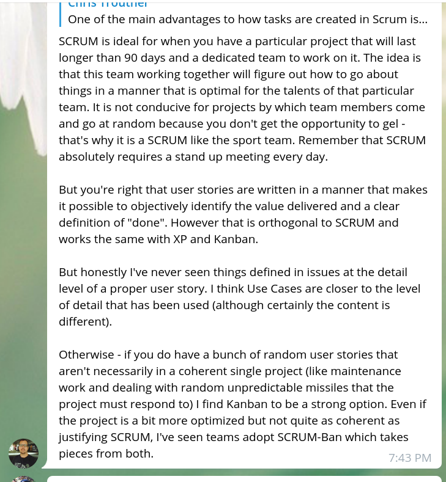
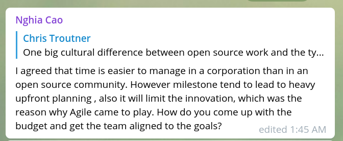

**TL;DR:** The model used to fund PSF projects for the last two quarters is flawed, mainly because it’s a top-down model. PSF needs a more flexible, bottom-up model for funding projects.

## Illuminating Project Funding Issues
I shared [my last blog post](/blog/scrum-psf-community), on incorporating aspects of Scrum, with the wider PSF community, and I got  some great feedback. Benjamin Scherrey pointed out some significant flaws in my thinking:

And Nghia Cao made several excellent remarks along the same lines. One in particular that stood out to me was:

It was the this comment from Nghia that really struck a cord with me.

Here is a summary of the funding model used by the PSF for the last two quarters:
- A bunch of projects are proposed and each idea is tagged with an SLP address.

- PSF members who have staked tokens receive and air-drop of funding tokens.

- Members then send the tokens to the SLP addresses to essentially ‘vote’ on what projects they want to see funded.

It’s become clear to me that the funding model used by the PSF for the last two quarters is flawed in more ways than one. Nghia’s comment really drove home one of those flaws: The approach is too top-down, and needs to be more bottom-up. There is way too much upfront planning involved. This makes the project inflexible and unable to adapt to a rapidly changing environment.

Another way in which the funding model is flawed is the lack of accountability. The projects have always been proposed with good intention, but most have not even been started due to a lack of technical talent or mangement bandwidth. This same lack of accountability can be seen playing out in Flipstarter, just like it did with Kickstarter and the ICO craze. Money is raised up-front, but there is no leverage to enforce accountability if the deliverables are not met.

## Towards a better funding model
With the flaws identified, we can work together as a community towards a better solution. I don’t have all the answers, but I am surrounded with brilliant people, and together we might be able to find a solution.

With the creation of the Community (CommComm) and Technical Steering Committees (TSC), the PSF now has a formal body to petition. A more bottom up approach would look like this:

- An idea is proposed and talked about in the PSF chat rooms.

- A technical person or team would put together a formal proposal, and more discussions would ensue.

- After it’s been organically discussed and refined, a formal proposal for funding could be sent to the CommComm or TSC.

- Token holders most impacted by the dilution of funding could voice their opinions in the VIP room, and the committees could discuss both the proposal and opinions of existing token holders.

- If a committee votes for funding, then a committee member would take on the task of being a liaison for the project. New tokens could be minted to fund the proposal, and the team would be accountable to the committee that funded them.

This would be a more organic, bottom-up approach, because an idea would have to gain momentum through the different levels of the community. It would also solve the accountability problem because each project would be answerable to the committee that funded them.

I would still like to see projects funded on a quarterly basis. This is enough time to see concrete results, and short enough that a project can’t go too far off the rails without running out of funding. Projects can always petition for additional funding on a quarterly basis.

The mechanics of funding is not terribly different than what has been done before. The main difference is the lack of top-down planning and administrative overhead. Instead, support for funding would grow more organically.

Either way, the funding would come at the cost of diluting the value to existing token holders. That’s why the new governance model was created: those impacted the most through this dilution will have the most control over what gets funded. At the same time, the planning and accountability issues will have been solved.
