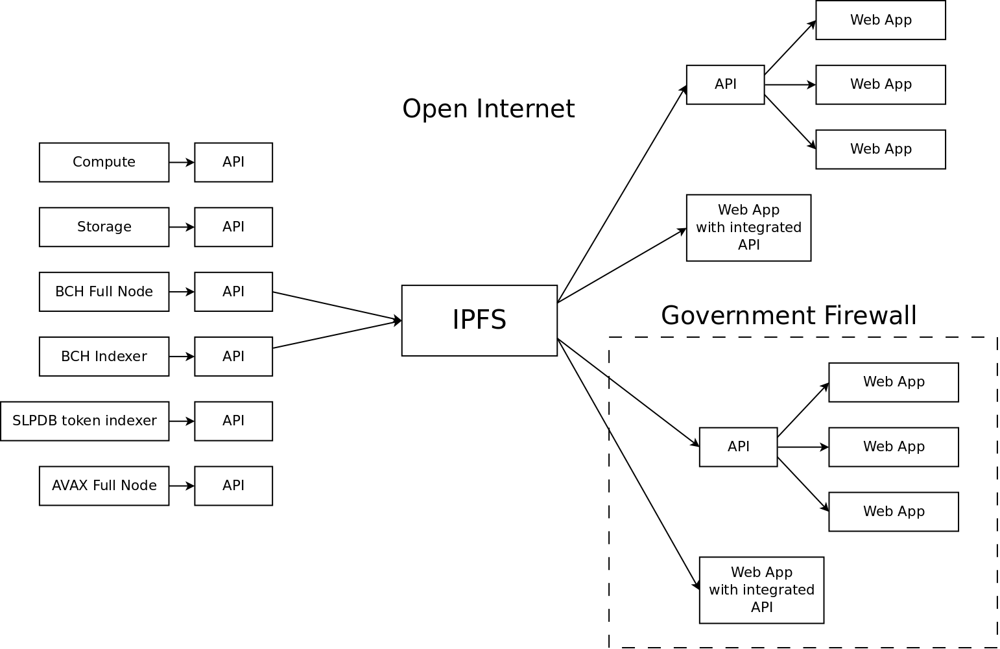

This post is a high-level explanation for building a censorship resistant API. An API is simply a way for two computers on the internet to talk to one another. It’s a prerequisite for conducting trade or organizing human activity, using the internet.

## The Problem
The REST API has been an industry standard for over a decade. Newer APIs, like gRPC, are also becoming popular. But all popular APIs are based on location-based addressing and suffer from the same centralized architecture and susceptibility to censorship.

## The Solution
The Inter-Planetary File System ([IPFS](https://ipfs.io)) is a fully-distributed network, and it deploys a concept called ‘circuit relays’. Both the topology of the network and the circuit relay concept make it extremely difficult to censor. The API proposed in this paper makes use of these features to create a nearly uncensorable API. These features are extremely useful for trade and communication, to democratize the internet, and to make useful apps that work anywhere in the world.

## The Solution Visualized

- In the center of the image is the IPFS network. This is the backbone of communication, utilizing a fully distributed network, content-addressing, and circuit relays to create a robust, censorship-resistant communication backbone.  

- To the left of the IPFS block are Services. These can be many things, but some of the more valuable services would include access to computation, access to storage, or access to different blockchains.  Services provide value to Consumers, and IPFS is used to connect Services and Consumers.  

- To the right of the IPFS block are Consumers. Consumers can be located anywhere in the world, and be behind different types of government, corporate, or personal firewalls.

  - Decentralized networking is complex and can lead to bad user experiences, compared to the centralized experiences that users are used to. The ‘API’ block connected to several ‘Web App’ blocks symbolizes a hybrid solution. The API block takes care of the decentralized IPFS communication. The end-users accessing the API block from a Web App still have the conventional, fast, and convenient user experience.  

  - For specific use cases, or in countries with strict firewalls, a Web App with an Integrated API can be used to access the IPFS network directly. It’s assumed that the use case is specific enough for the end user to accept the slower, more involved process for an app to maintain a robust connection to Services on the other side of the IPFS network.

## Services
The API specification that I'm developing would allow Service providers to enter and exit the network at any time. There will be a discovery mechanism for existing Services and Consumers to discover each other as they enter the network, and identify when they have left the network.

This architecture encourages a federated model, where many Service providers can provide redundant services and compete in a market for Consumers. This model allows anyone to provide a Service to the network, incentivizing decentralization.

## Consumers
The same peer discover mechanism allows Consumers to find other Consumers, or to orchestrate several Service providers to fulfill the needs of an app. Beyond the typical consumption of cloud-connected services, the Consumer-to-Consumer peer discovery allows apps to perform complex coordination. This allows complex interactions such as CoinJoin transactions, or the kinds of coordination required for an Uber or Airbnb type interaction.

## Ongoing Work
This video captures some of the early research I've done in this area:

<iframe width="560" height="315" src="https://www.youtube.com/embed/VVc0VbOD4co" frameborder="0" allow="accelerometer; autoplay; clipboard-write; encrypted-media; gyroscope; picture-in-picture" allowfullscreen></iframe>

I've also started a code repository to continue the work introduced in the video above:
- [ipfs-pubsub-prototype](https://github.com/christroutner/ipfs-pubsub-prototype)

## Comments
Share your thoughts on this post. Add your comments to [this Member.cash thread](https://member.cash/#thread?root=61d195f5b26d15d9cacc77474811635f31e90c3271114f56d119fac0fb34d4f6&post=61d195f5b26d15d9cacc77474811635f31e90c3271114f56d119fac0fb34d4f6)
