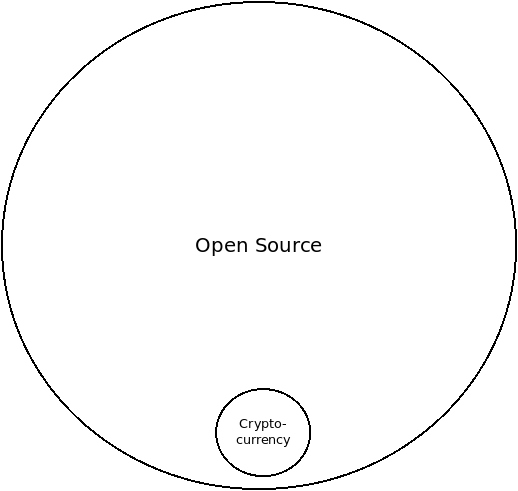
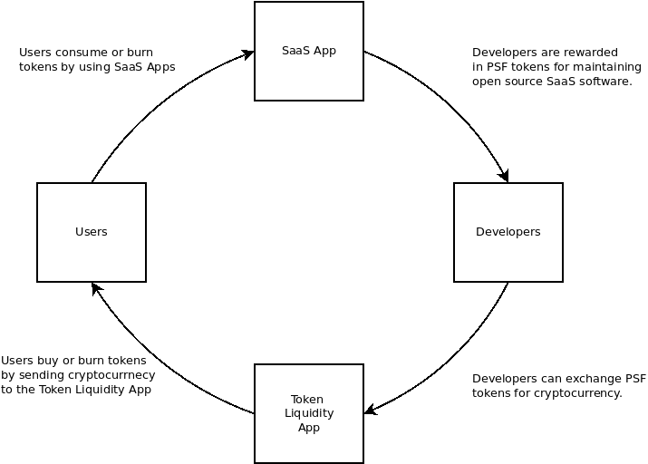
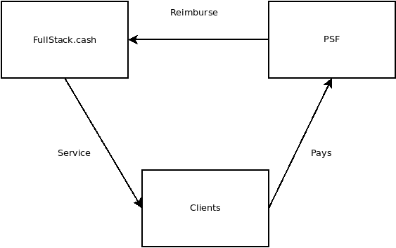

[The PSF](https://psfoundation.cash) has been a passion project of mine for almost three years, though it's really hard to pick a 'start' date. It's been an ongoing experiment to try and solve a puzzle. The name of the puzzle is: How do you sustainably fund the development and maintenance of open source infrastructure?

I really like the PSF's quarterly funding model, because it gives us a chance to look back every three months and assess what worked and what didn't. It does not allow bad ideas to fester for too long, and each quarter provides more data to drive decisions toward the 'good' (whatever that may happen to be).

It is this quarterly reflection that inspired this blog post. This is my opportunity to sit down, look at what's working and what's not. It's an opportunity to continue to ask the question, 'What is the PSF?'. An opportunity for me to try to articulate my thoughts so that I can share it with the rest of the community, so that we can collectively discover the 'good'.

## Open Source is a Journey

I've been creating and participating in open source communities for 20 years. It's been a journey of deeper and deeper understanding. Many people have been on this journey with me, and I've managed to collect a few gems of knowledge along the way. The PSF largely represents my attempt to apply these lessons to the creation of open source infrastructure for scaleable cryptocurrency.

Some thought leaders I follow closely in this space are:

- [Mikeal Rogers](https://twitter.com/mikeal) who started the [Node.js Foundation](https://nodejs.org/en/blog/announcements/nodejs-certified-developer-program/) and wrote [Healthy Open Source](https://medium.com/the-node-js-collection/healthy-open-source-967fa8be7951), both of which inspired the [PSF governance model](https://psfoundation.cash/blog/healthy-bitcoin).
- [Nadia Eghbal](https://twitter.com/nayafia) who wrote [Working in Public](https://amzn.to/3vbHerX), a seminal book on managing open source projects.
- [Jim Whitehurst](https://twitter.com/JWhitehurst) who wrote [The Open Organization](https://amzn.to/2TpvR2l), and was the CEO of Red Hat Linux.
- John Mark Walker is a writer on open source topics that I've started following recently. I was deeply inspired by his essay [Building a Business on Open Source](https://www.linuxfoundation.org/open-source-best-practices/building-a-business-on-open-source/).

The rest of this article is going to stitch together some of the lessons I've learned from the above thought leaders, and how they apply to the PSF. Basically, this article is going to be a condensed version of the articles and books linked above, and how I think they apply to the PSF.

## Crypto IS Open Source

Many developers in the cryptocurrency space reject the notion that there are lessons for the cryptocurrency industry to learn from the open source software industry. Their logic is that cryptocurrency is 'money' and somehow that separates it from open source software. Every brilliant developer I've met with this attitude has been incredibly _ineffective_ in their execution.

The above Venn Diagram is how I conceptualize the relationship between the cryptocurrency industry and the open source software industry. Crytocurrency **is** open source software. In fact, it's just a tiny segment of the much larger open source industry. _Every_ lesson gained from the open source industry can be applied to cryptocurency. Some cryptocurrency projects are _also_ trying to be money, and that extra feature may be one of the keys to unlocking sustainable funding of open source infrastructure.

## A Liberal Contribution Policy

It's a toss-up as to which open source community has had more impact on my life: Bitcoin or Node.js. While Bitcoin is characterized by the rampant toxicity and infighting of its community, Node.js is characterized by its effectiveness at producing quality, industrial software and managing a large, diverse community of developers. The [Node.js governance structure](https://psfoundation.cash/blog/healthy-bitcoin) was employed by Mikeal to grow the contributor base from 3 to over 300 active developers. The vast majority of whom are unpaid and voluntarily dedicate their time to the project.

Working for Bitcoin.com, on the software that eventually became the [PSF Core software](https://psfoundation.cash/blog/towards-a-roadmap), was my first experience getting _paid_ to work on open source code. Prior to that, I had written lots of open source code and contributed to open source projects, I had just never been paid. I also had a ton of experience participating in open source communities before that job.

One of the first, disappointing realizations that I had while working there was that Bitcoin.com was clearly building an open source _product_ and not an open source _project_. Furthermore, I realized that company management had no conceptual understanding of the important (but nuanced) difference between the two. They were releasing the code as open source, but they were strictly gate-keeping the code that went into it. They had some vague notions about monetization, but had no clear path to either profit or sustainable maintenance of the code base.

Unfortunately, I carried forward this bad habit of gate-keeping additions to the code. But over the last year I've really internalized the idea of the _liberal contribution policy_ described in [Healthy Open Source](https://medium.com/the-node-js-collection/healthy-open-source-967fa8be7951). The JavaScript community, and the Node.js project in particular, is famous for their radically open policies to code, which are optimized to lower the barriers for new contributors to participate in a software community. The crux of the idea is that code submissions should _land by default_, instead of the opposite which is to block them until they can be carefully code-reviewed (which is the norm in a company).

I'd been struggling to conceptualize a development workflow that would allow for a liberal contribution policy while still maintaining high quality production-ready code for FullStack.cash.

The solution I had come up with was to create a separate GitHub group for FullStack.cash production software, where I could maintain tight control over the code for 'my' organization. The code in the FullStack group would be forked from the PSF group. So FullStack would be considered the 'downstream', and PSF would be considered the 'upstream'. The 'upstream' repository would have a liberal contribution policy, while the 'downstream' repository would maintain tight QA control and production-ready code.

I was vindicated recently when reading [Building a Business on Open Source](https://www.linuxfoundation.org/open-source-best-practices/building-a-business-on-open-source/), where he recommended exactly this strategy for differentiating an open source _product_ from an open source _project_.

## A Circular Economy

When I first conceptualized the PSF and what sustainably funded infrastructure would look like, I had the image below in mind: a simple, virtuous, circular economy where usage would drive value of the token and innovation in the software:

This idea was echoed by Galia Benartzi when [describing community currency research](https://youtu.be/LcbHTF3zCdI) that lead to the Bancor project. And the idea was further enhanced by Nadia Eghbal in [Working in Public](https://amzn.to/3vbHerX), where she does a deep dive into intrinsic (passion) vs extrinsic (money) motivation when applied to open source developers.

This is why I'm so passionate about the [pay-to-write database project](https://github.com/Permissionless-Software-Foundation/ipfs-p2wdb-service) (P2WDB). It follows the simple incentive model illustrated above.

But the P2WDB project is in its infancy, and the road up to this point has been very bumpy. While much of the PSF software is geared to follow the above model, adoption has failed to grow as fast as I had hoped, and the PSF is still far away from a point where extrinsically motivated developers can take over the maintenance of the projects from the intrinsically motivated developers (such as myself).

While an open source _project_ can live for years with no overhead costs, propelled by a few intrinsically motivated developers, an open source _product_ lives and dies based on the company driving it. And anything that can kill the company, such as liability or insolvency, can also kill the product.

## Build a Business?

The PSF is muddling the lines between being a company, a foundation, and a community. I've gotten rather comfortable with our ambiguous state, and embrace our non-legal existence. But it's extremely confusing for everyone else, and that confusion is disencentivizing businesses from joining our consortium. It's also impacting our effectiveness as an organization, as there is little consensus around the answer to the question: 'What is the PSF?'.

Supporters and founders of the PSF have suggested we create a 'front facing' company to be the PSFs representative in the fiat world. It could accept fiat donations and be a 'real' legal entity. It could legitimately hire developers. It could be a respectable organization, with branding and intellectual property. The potential to bring in money could help the organization _grow_. After all, who doesn't want to see rapid growth?!

It would also need a steady income ...presumably from donations? That means it can also run out of money and go bankrupt. It could also be sued ...but maybe that's a good thing, as it could shield the people associated with the organization?

One conceptualization of the PSF would be as a research and development organization. Our token economic model could help businesses share the cost of research and development by pooling resources. I like this idea on its surface, but I'm hesitant to be the focal point for a legal organization that I don't understand and am not fully aligned with.

There is an argument to be made that PSF could gain donations easier if it had a front-facing representative, which could more easily incentivize businesses to join the consortium. There is also a lot of money available if PSF can tap into the sea of money behind engineering-for-hire services.

None of that is bad, but it is rather distracting from the original goal I set out to achieve: being the change I want to see in the world, by collaborating with other developers to write good code and improve the software infrastructure in this space. For me, everything beyond that is a detail or a distraction.

## FullStack.cash

I honestly don't know where PSF ends and FullStack.cash begins. I don't know how to explain the relationship between the two. So far, the relationship has looked like this:

FullStack.cash renders infrastructure services to clients. But the PSF sends out invoices to those clients, and clients pay PSF directly. The PSF then reimburses FullStack.cash for cost of goods sold (in tokens). This ensures that any profit goes to burn tokens, which is in line with the circular economy I've been trying to achieve. But tax liability is rather dubious as 'profit' (and the tax burden of such) rests on an entity that legally doesn't exist and does not reside in any physical jurisdiction.

The branding and segregation between an open source _product_ (FullStack.cash) and a _project_ (PSF), as described in [Building a Business on Open Source](https://www.linuxfoundation.org/open-source-best-practices/building-a-business-on-open-source/) is an attractive model to follow, but that would change the nature of the flow of revenue. Right now FullStack.cash is burning nearly 100% of the PSF tokens each month. How do we avoid a conflict of interest between FullStack.cash and PSF? What would the token-burning model look like if FullStack.cash was isolated as its own separate entity?

## Token Flow

Finally there is token-flow. Below is a chart of the 'Net Token' flow over the last year. Dots above the zero-line means the PSF token increased the amount of BCH backing it. Dots below means the amount of BCH backing the token decreased. Said another way: above the line is good, below the line is bad. The 9-month trend-line is showing growth, but the last few months have been pretty flat, with small gains that could easily be wiped out.

It begs the question, what is actually driving the flow of tokens? From most impact to least, here is the best I can figure:

- Speculation - This is bad. The math behind the token-liquidity app is supposed to disencentivize this, but outcomes have not matched expectations. This is causing price volatility and adding noise to the data.
- Development donations - This is good. We've had some interested parties buy tokens to sponsor software development. But this also causes volatility, and dubious long term benefits to the token price. PSF members have been discussing a new model around NFTs to solve this problem.
- FullStack.cash SaaS burns tokens every month. This is the best.
- Fans - This is good. PSF does have some fans that are willing to own enough tokens to gain access to the VIP room and keep tabs on the inner circle. This is good, but small.
- Payments to developers come in two types:
  - Core software development pays out tokens, but brings in no income, so this decreases the price of the token. Sort of a necessary evil, and should be minimized.
  - Developers being hired and paid in PSF tokens. This has mostly net-zero effect on the token price, but is slightly beneficial.

With the exception of speculation, none of the items above are bad, but their relative impact is not matching my expectations. Ideally, SaaS burns would be the greatest driver with the most impact, and speculation would have the least impact. Payments to developers require a lot of overhead and management, and has a very small net effect on the token price, which is disappointing.

## Playing Games

From a game-theoretic standpoint, it seems to me that the PSF is playing two distictly different games:

- One is a fiat-pegged game. Money comes in, money goes out, based on work done.
- One is a token-based game with no consideration of fiat. It involves:
  - Inconsistent, intrinsically motivated work primarily,
  - Complimented by a little extrinsically motivated work, incentivized by a closed-loop token economy.

The rules of the first game are based on fiat, and are the ones most people are comfortable playing. It's just a business, and it plays by the same rules all businesses play by. Money comes in, money goes out. There are taxes, and legal liability, and intellectual property to worry about. There is overhead and accounting, management, hiring, and all the other things that businesses do when playing the 'let's stay in business' game.

The second game is all about burning tokens. There is the token, the reserve asset, and the floating peg between the two. Trying to tie the game to fiat is confusing, and as I'm discovering, detrimental to winning the game. The key to winning this game is to maintain a balanced budget, and growth is proportional to the amount of tokens burned. It's a slow slog.

One of the most interesting things to me about the second game is that it's native to cryptocurrency. It does not rely on or need to touch fiat. It does not need to be a legal entity or exist in any physical location. It embodies all the best qualities of decentralization.

The first game is much more comfortable because it's conventional (older and better understood). The second game is unconventional, and not fully baked yet. The first game can be accelerated through outside investment or donations, the second game can be accelerated through increasing the number of intrinsically motivated developers, collaborating slowly, whenever their passion and time allow.

As an organization, we're slowly losing both games. Everyone involved, including myself, is attracted to the conventional game because its comfortable and has the potential for rapid growth. But the unconventional game is simpler, and applies directly to the goals I set out to achieve. If played correctly, either game (or both?) could result in sustainable funding of development.

Where we go from here is not up to me. Many look to me as a leader, but I'm making a consistent effort to point out that I don't have all the answers. I recognize that I can not succeed on my own.

Success means achieving sustainable funding of open source infrastructure. Success will come from the PSF community, and not any one individual.
