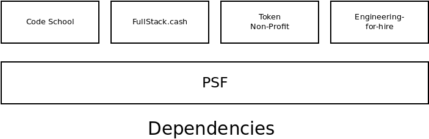
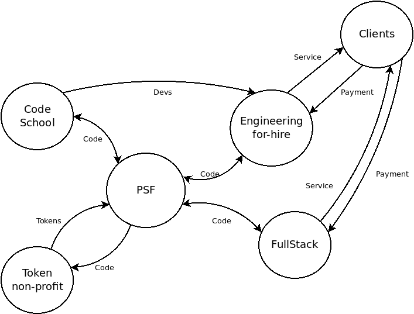

In the Open Source software community, it's become common to collectively refer to a code repository, the developers working with the code, and the users consuming that code as a 'Project'. A 'Project' is not any one of those things in isolation, but the collection of them together. The Node.js Project. The Linux Project. The Mocha testing framework. The Babel transpiler. These are all examples of open source projects.

A Foundation, like the [OpenJS Foundation](https://openjsf.org/) or [Apache Foundation](https://www.apache.org/), collect and steward Projects. This is the same role that the PSF has been playing.

A Product, without any reference to open source, is pretty widely understood. It belongs to a company and there is branding and other business considerations attached to it. Understanding the intersection of a Product and an open source Project is a puzzle that has fascinated and dogged me for years. Is there a bright line separating the concepts or do they amorphously bleed into one another? What is the 'proper' way to balance these ideas or blend them together?

[My last blog post](/blog/what-is-psf) started to explore this idea in earnest. I've started to mentally unwrap the tangle of concepts that make up the [PSF](https://psfoundation.cash), [FullStack.cash](https://fullstack.cash), and other ideas community members of the PSF have about the organization. [Building a Business on Open Source](https://www.linuxfoundation.org/wp-content/uploads/Building_a_Business_on_Open_Source_Ebook.pdf) greatly clarified my thinking around these topics. I've continued to have conversations with PSF members and experienced thought-leaders like [Mikeal Rogers](https://vimeo.com/52639930).

This blog post captures some of my latest ideas on Open Source Products vs Projects, and how these ideas relate to the [Permissionless Software Foundation](https://psfoundation.cash).

## Characteristics

Over the course of continuously asking myself the question 'What makes up a Product vs Project?', I collected characteristics that distinguish one concept from the other. This comparison and contrast has helped me grasp the nature of the relationship between the two concepts:

- **Products:**

  - Die when the company behind them dies.
  - Can have a brand built around them.
  - May have a scope, but that scope is less important than product-market fit and pivoting to meet user needs.
  - When a product needs specialized knowledge to take the next step in its evolution, money and people go into action to fill those gaps.
  - Products are primarily developed through Extrinsic motivation.
  - A product focuses on serving specific end-user needs.

- **Projects:**
  - Never die. They simply go into hibernation until a new maintainer picks them back up or forks the project.
  - Branding is confusing and does not work very well, because there is no hard accountability (like a product has).
  - Has a clearly defined scope.
  - When a project needs specialized knowledge, it suffers until/unless someone with the right knowledge starts to participate.
  - Projects are primarily developed through Intrinsic motivation.
  - A project focuses on serving broad-based industry/infrastructure needs.

[Building a Business on Open Source](https://www.linuxfoundation.org/wp-content/uploads/Building_a_Business_on_Open_Source_Ebook.pdf) explains how to setup a healthy, symbiotic relationship between Projects and Products:

- Companies build Products (downstream) and regularly pull down updates from the Project (upstream).
- They also feed improvements back upstream to the Project, through Pull Requests and patches.

Through that relationship, both parties are better off. Since they are playing two distinct roles, the relationship is win-win and there is no conflict of interest.

## Configuring Relationships

Recent discussions I've had with PSF membership and industry advisors have inspired me to draw out some diagrams of what these relationships between a Project and a Product could look like. I use the PSF as an example here, but these ideas are only intended to foster discussion. They are not a proposal for the future.

The lens through which I'm viewing a lot of these lessons around Product vs Projects is the relationship between the PSF, FullStack.cash, and private companies that will join the community. Like the Linux Foundation, the PSF is intended to be made up of a consortium of complimentary businesses. Some ideas on the table for other complimentary businesses are:

- A 'Code School' to help developers gain cryptocurrency experience and achieve standardized certifications.
- An engineering-for-hire company that could help to match developers and entrepreneurs, and then manage the resulting projects.
- A non-profit organization for custodying keys and managing the token liquidity app. A sort of 'firewall' between the PSF community and any required legal compliance.

Underpinning all these organizations is the PSF, which focuses on its custodianship and maintenance of code, code which all these organizations depend on. If the businesses behind a Product can be analogized as a building, the PSF would be the slab of concrete they are all built on top of. The dependencies could be visualized like this:

That image above depicts the **dependencies**, clearly showing that all the businesses depend on the PSF and share it in common. The dependencies are simple and straightforward. However, that image does not capture the nature of the **relationships** between the entities. That's not so simple, but equally important.

The image above captures the flow of value and the nature of the relationships between the consortium entities.

- In the image above, PSF is a _Foundation_, which stewards code, much like the OpenJS Foundation stewards the Node.js project. [The PSF would maintain the same governance structure it has now](https://psfoundation.cash/blog/healthy-bitcoin). The [PSF Core software](https://psfoundation.cash/blog/towards-a-roadmap) would be considered the primary project under the stewardship of the PSF, but also, only _one_ of the projects under its care.  

- In this view, [FullStack.cash](https://fullstack.cash) is a business with an open source _Product_, which exchanges code with the PSF Core Project as described in [Building a Business on Open Source](https://www.linuxfoundation.org/wp-content/uploads/Building_a_Business_on_Open_Source_Ebook.pdf). FullStack.cash services external clients and receives payment for that service. This means FullStack.cash would be a for-profit company and its current model of burning PSF tokens would need to change. More on that later.  

- A Non-profit corporation for working with tokens would be created, and it would have a closed-loop relationship with the PSF. This organization would focus on _custody_ of keys for minting batons and _managing_ token-focused software like the token-liquidity app and cross-chain token bridges. They would mint and distribute tokens according to the direction of the PSF. It's primary reason for existence is to _attempt_ to be compliant with laws around token creation and management. (At this point in history, I believe actual compliance is impossible due to opaque guidance and over-reaching jurisdictional enforcement, but I'm no lawyer, and this entity could exist to navigate those waters as best as it can.)  

- An engineering-for-hire company could be formed to cater to the ever-present market demand for talented cryptocurrency developers. Importantly, this companies fate would not be tied to the PSF. It's success or failure would not necessarily reflect on the PSF or its projects, though there would be a steady flow of communication around code. There could also be many engineering-for-hire companies associated with the PSF.  

- Another clear market need that should be serviced is a 'code school' that can help serious cryptocurrency developers distinguish themselves against the background noise of scams and hype. Such a business, with a close relationship to the PSF, could generate great branding. It would have a natural symbiotic relationship with the PSF and the engineering-for-hire companies. There are various business models around coding bootcamps that could be applied to this organization, and fit nicely given a relationship with the engineering-for-hire company.

The diagram of relationships resembles a constellation of Products revolving around the PSF at its center. The relationships between Products is loosely coupled, but they all share the gravity of the PSF in common.

## Token Economics

The above architecture of relationships have an impact on the token economics of the PSF. Each company and Product has a dependency on a Project stewarded by the PSF, and they are not required to have a direct relationship with the PSF token. Instead, their relationship switches to a model similar to the Linux Foundation: the companies relationship with the token would be purely for supplying financial support to the PSF (donations) and to influence the governance of the Project (by gaining the right speak in [the VIP room](https://t.me/psf_vip)).

This means that the Products in the diagram are not included in the circular economy depicted below. That's a bit of a sacred cow for me, as that idea of a circular economy was largely the inspiration for the creation of the PSF. But perhaps its time for that sacred cow to evolve.

I still believe that a self-funding, circular economy using tokens is still possible. Where:

- Developers maintaining software are rewarded in tokens.
- Usage of software burns tokens, making the tokens held by developers more valuable.
- Continuous improvement drives increased usage of the software. This improvement comes from two sources:
  - Intrinsically motivated development will add new features that spur growth.
  - Extrinsically motivated development will prevent code-rot and increase reliability.

This idea is not necessarily something that the PSF needs to stop focusing on. The PSF as a Foundation can still develop code like the [pay-to-write database](https://github.com/Permissionless-Software-Foundation/ipfs-p2wdb-service) project, which is perfectly aligned with the above diagram.

This is an important nuance in the scope of the work done by PSF. I imagine the community will need to be careful about how it categorizes the code under its stewardship. It will need to view each code repository through the lens of the token economy:

- Much of the software that is used commercially, and does not fit the closed-loop token economy, will expect donations to power the development and maintain the software.
- The few software repositories that _do_ fit well withing the closed-loop economy model, can self-fund the extrinsically motivated work to improve their code.

_Maintenance_ and _reliability_ are two valuable considerations for any software project. Any desire to improve these metrics require funds to pay for necessary extrinsic motivation, as intrinsic motivation is hard to come by for these two areas. _Documentation_ is often another area where intrinsic motivation is ineffective too.

The closed-loop framework provides a self-funding mechanism for bootstrapping a project from purely intrinsic activity, to generate funds for the necessary extrinsic motivation. If this model is not viable, then donations is the only viable funding mechanism that I can see.

If I'm right in this conclusion, it will be critically important to categorize and segregate the software repositories based on how they fit within the close-loop token economy. Am I right in drawing that conclusion? That's the discussion I'm looking to have.
