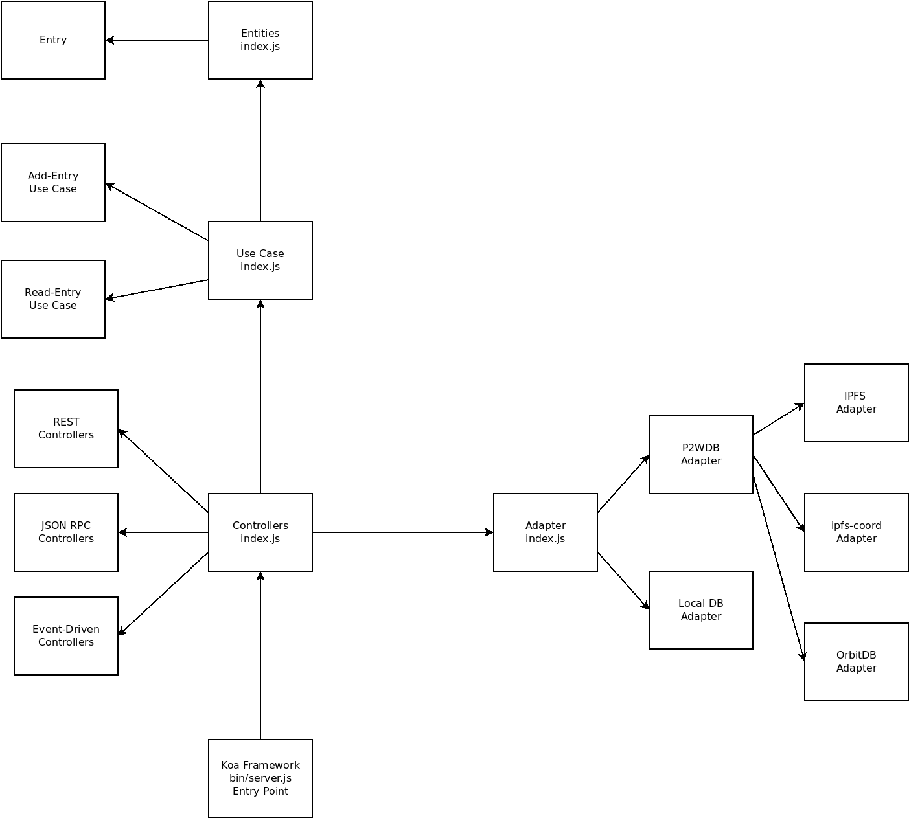

**Clean Architecture** is a software design pattern created by ['Uncle Bob'](https://blog.cleancoder.com/uncle-bob/2012/08/13/the-clean-architecture.html). There are two main advantages to using this design pattern:

- It manages increasing complexity as new features and interfaces are added over time.
- It provides defense against [code rot](https://en.wikipedia.org/wiki/Software_rot) by isolating the parts that rarely change from the parts that change frequently.

I ran across [this great video](https://youtu.be/CnailTcJV_U) by Bill Sourour applying the Clean Architecture concepts to a REST API server built using node.js and the Express framework. After studying it for some time, I adapted the design patterns in that video and applied them to the [P2WDB](https://github.com/Permissionless-Software-Foundation/ipfs-p2wdb-service) and the [ipfs-service-provider](https://github.com/Permissionless-Software-Foundation/ipfs-service-provider) repositories.

In this video, I expand on the Bill's original video and show how I applied Clean Architecture to my own REST API server using the Koa framework.

<iframe width="560" height="315" src="https://www.youtube.com/embed/LftjSIbHzbo" frameborder="0" allow="accelerometer; autoplay; clipboard-write; encrypted-media; gyroscope; picture-in-picture" allowfullscreen></iframe>

Code is split up into four groups:

- Entities
- Use Cases
- Adapters
- Controllers

Without knowing the patterns and reasoning behind Clean Architecture, the code will look 'weird' to most JavaScript developers. This is because Clean Architecture comes from outside the JavaScript world and some of it's core ideas (like dependency inversion) don't translate easily into JavaScript.

## File Layout

The code in the `src` folder of this repository is split up into four main directories: `entities`, `use-cases`, `adapaters`, and `controllers`. These directories reflect the arrangement of concerns in the Clean Architecture diagram:

The above diagram is reflected in the code. The Controllers and Adapters both make up the green circle. I distinguish between the two:

- Controllers are _inputs_ that cause the app to react.
- Adapters are _outputs_ that the app manipulates, like a database.

The diagram below shows how dependencies are arranged in the P2WDB project:

Major features of the diagram above:

- The blunt point of an arrow connects the file that depends on the file pointed to by the pointy end of the arrow.
- The dependencies in the above diagram follow the dependency arrows in the Clean Architecture diagram.
- This project is a Koa web server app. Koa is a framework and the entry point of Koa program loads the Controllers first.
- The Controllers load the Adapters, then it loads the Use Cases, then finally the Entities. Each lower stage depends on the stage above it.
- Dependency Injection is used heavily to pass dependencies to the individual libraries.
- Encapsulation pattern is used for unit tests.

Moving forward, I plan to use this design pattern in all my code. I spent a couple weeks refactoring the [ipfs-service-provider](https://github.com/Permissionless-Software-Foundation/ipfs-service-provider) to match these patterns and achieve 100% unit test coverage. That repository is intended to be a _boilerplate_ for create decentralized, censorship-resistant providers of web services. I encourage all JavaScript developers to study this pattern and fork my code for their own use.
