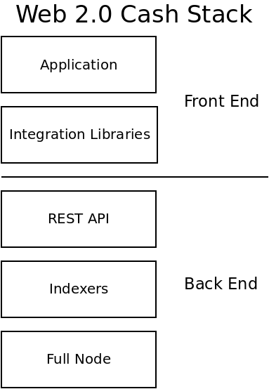
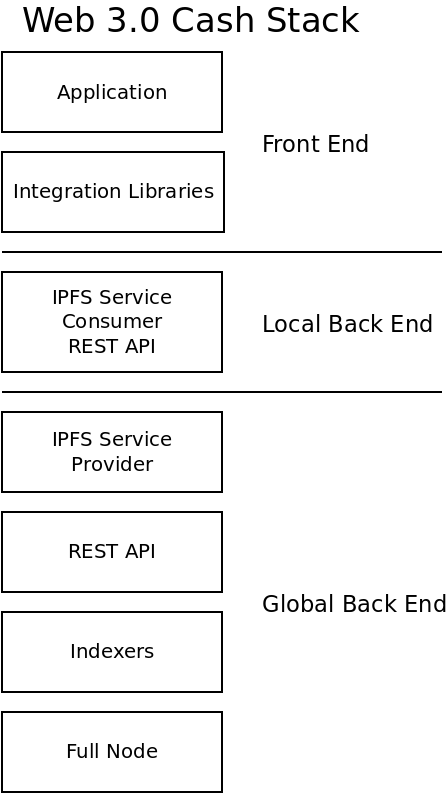

There are [many interpretations](https://medium.com/s/story/why-decentralization-matters-5e3f79f7638e) of [Web 3](https://ethereum.org/en/developers/docs/web2-vs-web3/), but a common thread in all of them is an emphasis on re-decentralizing the web. Web 1.0 was very decentralized. Web 2.0 was centralized. Web 3.0 will be re-decentralized.

In early 2021, I started to earnestly dig into the inner workings of [IPFS](https://ipfs.io), to answer one burning question: "_What is the best way to decentralized back-end infrastructure?_"

This blog is an example of a decentralized front-end app, delivered over IPFS, hosted on the Filecoin blockchain. That's great for a blog or a publisher. But to do really sophisticated business applications requires censorship-resistant access to databases, blockchains, and other back-end infrastructure. [IPFS API](/blog/ipfs-api) was my first attempt to conceptualize how to wire back-end infrastructure over IPFS. Over the last year I've developed, configured, and re-configured the code and networking behind the [Cash Stack](https://psfoundation.cash/blog/cash-stack) in an attempt to find the best configuration.

This blog post summarizes my findings. It's my attempt to describe the path before me, the path I think that lies before the entire blockchain industry. Censorship is coming, and only the decentralized projects will survive. The Use Cases and software architecture in this post provide a map for projects to build a durable foundation of infrastructure.

## Use Cases

Before discussing the _How_, let me present the _Why_. I was trained to always remember the 'User Story' or the 'Use Case'. _Why_ am I building what I'm building? What problem is it trying to solve? That's what the Use Case captures. Users that want to access blockchain infrastructure can be categorized into one of the following use cases:

### Casual Users:

- Familiar with installing a phone app or visiting a web page, but no significant technical knowledge.
- Web 2.0 is the most efficient for this. Latency and connectivity issues of IPFS are not appropriate.
- Not willing to pay money for service. Might be willing to sign up for an account, but would prefer not to.

### Exchange or professional company:

- Has money to spend on infrastructure.
- Needs isolated (not shared) infrastructure.
- Needs high-speed, cloud-based infrastructure. Expects the speed and good UX of Web 2.0.

### Hobby Developers:

- Does not have a lot of money to spend on infrastructure.
- May or may not have the ability to run their own full node and other back end infrastructure.
- Important to support because this is where a lot of innovation comes from.

### Censored Users:

- Lives in a country, or working within a company, that is actively trying to prevent them from accessing the blockchain.
- This user wants to circumvent the censorship and is willing to jump through more hoops than the Casual User.
- Not willing to pay money for service. Might be willing to sign up for an account, but would prefer not to.

## Network Architecture

Based on my research over the course of 2021, I will discuss different configurations of the [Cash Stack](https://psfoundation.cash/blog/cash-stack). The first configuration uses strictly Web 2.0 principles. The other configuration blends in components that involve IPFS. Which configuration is appropriate, depends on the Use Case being considered.

### Web 2.0

Below is the 'Web 2.0' version described in [this Cash Stack post](https://psfoundation.cash/blog/cash-stack). The centralized architecture is far more efficient and scalable than any 'Web 3.0' or decentralized architecture. It gave birth to the [Saas Business Model](https://www.profitwell.com/recur/all/saas-business-model). As far as blockchain is concerned, this architecture is the most appropriate for the _Exchange_ use case. If there is an Exchange (or company) willing to pay the bills, they can financially sustain the preferred user experience (UX) of the _Casual User_ use case.

The achilles heel of this model is **censorship**. It's fragile in the face of any censorship. There are well-established industry best practices for censoring this architecture. This architecture is not appropriate for the _Censored User_ use case.

This architecture is also expensive. It's not practical to run this architecture from a home server. Cloud infrastructure is required in all but the most exceptional of cases. Cloud infrastructure has a monthly cost. Stop paying and the infrastructure disappears like smoke. _Hobby Developers_ may be able to run this infrastructure at home, but they can not break out of the hobby-category without funding.

### Web 3.0

The Web 3.0 Cash Stack inserts two new blocks into the middle of the stack, which are mirror images of one another:

- _IPFS Service Provider_ - Proxies the REST API over IPFS.
- _IPFS Service Consumer_ - Proxies IPFS communication to a 'local' REST API.

By adding these two new pieces of software, it decouples the expensive 'global' back end infrastructure, and proxies it to a much less expensive 'local' back end REST API. This has several advantages:

- Because IPFS automatically handles the complex networking, it's much more pragmatic to run the expensive global back end infrastructure from a home internet connection. This reduces the greatest cost of the Web 2.0 model.  
- By leveraging [Circuit Relays](https://docs.libp2p.io/concepts/circuit-relay/), this architecture is extremely resistant to attempts at censorship.  
- Because of the decoupling, the _local back end_ is capable of using one-of-many instances of the _global back end_. It only needs to connect to one in order to succeed, and it can choose any instance on the network.

If implemented correctly, the performance should be acceptable to the _Casual User_ use case. The extra layers adds some latency, but it provides much lower cost. Weather this architecture is appropriate for the _Casual User_ use case depends on the specific application, but the trade-offs may be acceptable. If there is no company to pay for web 2.0 architecture, this web 3.0 architecture may be the only financially practical way to roll out an app for _Casual Users_.

This architecture really exceeds at the _Hobby Developer_ and _Censored User_ use cases. It should be noted that the 'local' REST API can be embedded entirely in a web browser. This allows _Censored Users_ the convenience of loading an IPFS-based web page in their browser, to achieve the ability to circumvent whatever actor is attempting to censor them.

This is the most flexible architecture for the _Hobby Developer_. Developers unfamiliar with running back end infrastructure, who want to focus primarily on front end applications, can run a single, simple app to provide the local back end. Developers more comfortable with Dev Ops and running back end infrastructure, can provide the global back end infrastructure to the rest of the community, from the comfort (and cost-savings) of their own home. The [Permissionless Software Foundation](https://psfoundation.cash) is offering [Bounties](https://github.com/Permissionless-Software-Foundation/bounties) to incentivize hobby developers to run this global back end infrastructure.

## Software

The descriptions above are abstract. This section is for developers that want to know the specific software implementing the architecture. The software running the Web 2.0 architecture is documented in [this Cash Stack post](https://psfoundation.cash/blog/cash-stack). Here is the new software implementing the Web 3.0 architecture:

- [ipfs-bch-wallet-service](https://github.com/Permissionless-Software-Foundation/ipfs-bch-wallet-service) sits at the top of the global back end. It connects to [bch-api](https://github.com/Permissionless-Software-Foundation/bch-api), or to the infrastructure at [FullStack.cash](https://fullstack.cash), and it proxies it over IPFS using a JSON RPC interface.  
- [ipfs-bch-wallet-consumer](https://github.com/Permissionless-Software-Foundation/ipfs-bch-wallet-consumer) is the mirror image of [ipfs-bch-wallet-service](https://github.com/Permissionless-Software-Foundation/ipfs-bch-wallet-service). They communicate over IPFS, and ipfs-bch-wallet-consumer provides local REST API endpoints for the front end to interact with.  
- [ipfs-coord](https://www.npmjs.com/package/ipfs-coord) is a core library used by both of the above software projects. This allows IPFS nodes to find one another, circumvent firewalls, stay connected, and communicate securely.  
- [minimal-slp-wallet](https://www.npmjs.com/package/minimal-slp-wallet) is a JavaScript library that provides basic Bitcoin Cash wallet functionality. It can interface with a local instance of ipfs-bch-wallet-consumer via its REST API. This library is used by [gatsby-theme-bch-wallet](https://github.com/Permissionless-Software-Foundation/gatsby-theme-bch-wallet) which you can interact with at [wallet.fullstack.cash](https://wallet.fullstack.cash).
