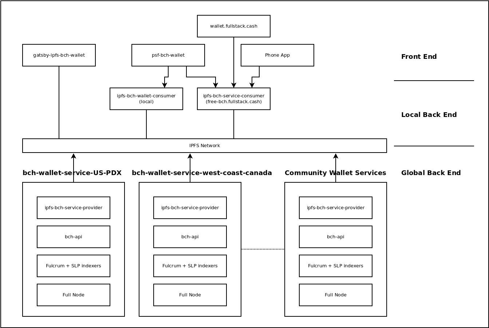
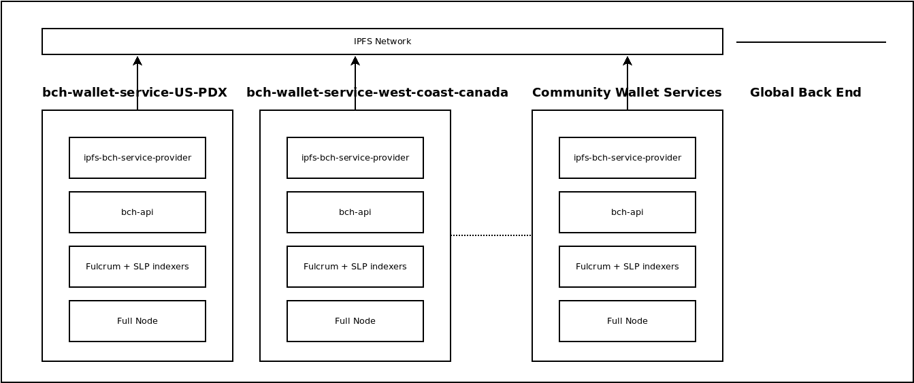
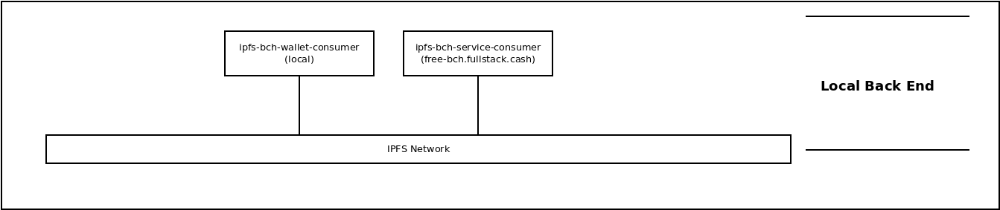
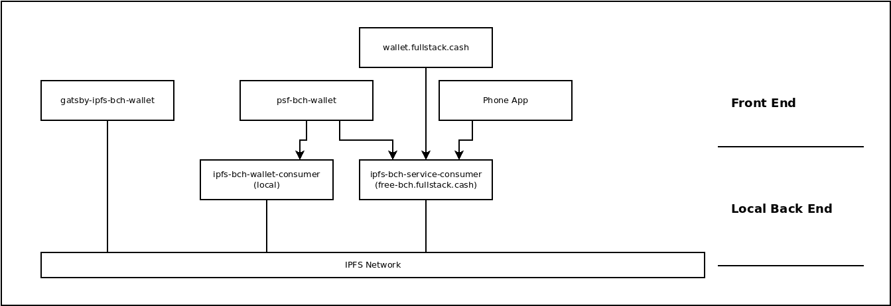

The previous blog post provided a very high-level overview of the [Web 3 Cash Stack architecture](/blog/web-3-cash-stack). This article descends into various implementations of that architecture that I, and other decentralized members of [the PSF](https://psfoundation.cash), are in the process of standing up.

If the images appear too small to read the text, click on them to open a larger version of the image.

While it looks lot busier, the image above has all all the same features as the simplified Web 3 diagram in the previous blog post. It's easier to describe how all the pieces fit together by walking through the three main layers of infrastructure:

- Front End Software
- Local Back End Software
- Global Back End Software

## Global Back End

The global back end is the part of the software stack that has changed the least. While the original [Cash Stack](https://psfoundation.cash/blog/cash-stack) has had steady improvements, it's basic architecture has changed very little in the last three years. What _has_ changed is the emphasis on software further up the stack that interfaces with it, and putting the [JSON RPC over IPFS](https://github.com/Permissionless-Software-Foundation/ipfs-service-provider) on equal footing with the conventional REST API.

Whereas the focus has been on [bch-api](https://github.com/Permissionless-Software-Foundation/bch-api) in the past, there is a new focus on the [ipfs-bch-wallet-service](https://github.com/Permissionless-Software-Foundation/ipfs-bch-wallet-service) as the primary way to interface with the back end infrastructure. `bch-api`, our Web 2.0 workhorse, isn't going anywhere. It's flexible and high-resolution REST API interface will always be preferred for Web 2.0 companies and exchanges. `ipfs-bch-wallet-service` compliements `bch-api` by [simplifying the API](https://ipfs-bch-wallet-service.fullstack.cash/#api-JSON_BCH) to a few endpoints that are needed for common wallet use cases. It also provides this API over two interfaces:

- REST API over HTTP
- JSON RPC over IPFS

The JSON RPC over IPFS is what unlocks the real power of web3. Because IPFS automatically handles the networking and easily penetrates firewalls, the global back end software can use consumer hard drives, in normal desktop computers, using home internet connections. This directly competes with the cloud infrastructure needed by Web 2.0 apps, and drastically lowers costs. It also makes it easier for web3 community members to support one another, and improves decentralization.

In the image, two PSF servers are called out by their [ipfs-coord](https://www.npmjs.com/package/ipfs-coord) names:

- bch-wallet-service-US-PDX
- bch-wallet-service-west-coast-canada

There are more than these two serves on the network, and more are will be added in the future thanks to [PSF bounties](https://github.com/Permissionless-Software-Foundation/bounties). Because these back end servers are interchangeable, the software higher up in the stack can choose one-of-many in order to achieve its goals. They all connect to a common 'bus', which is a subnetwork on IPFS, created by the [ipfs-coord library](https://www.npmjs.com/package/ipfs-coord).

The JSON RPC over IPFS interface lowers costs, improves decentralization, and improves reliability.

## Local Back End

The concept of a 'local' back end is a new concept introduced in the web3 Cash Stack architecture, and it's largely encompassed by a single piece of software: [ipfs-bch-wallet-consumer](https://github.com/Permissionless-Software-Foundation/ipfs-bch-wallet-consumer). This is the mirror image of [ipfs-bch-wallet-service](https://github.com/Permissionless-Software-Foundation/ipfs-bch-wallet-service).

Compared to the Global Back End, `ipfs-bch-wallet-consumer` is a very 'light' piece of software. It can run comfortably on low-power computing devices, like the [Pi 400](https://www.raspberrypi.com/products/raspberry-pi-400/), with a minimal internet connection.

Eventually, `ipfs-bch-wallet-consumer` will automatically find and connect to the lowest-latency wallet service it can find on the IPFS network. All communication between the two pieces of software is end-to-end encrypted.

`ipfs-bch-wallet-consumer` provides a convenient, local [REST API interface](https://free-bch.fullstack.cash/) for programmers to develop against. This allows experienced Web 2.0 developers to leverage IPFS without needing to know anything about it or changing their workflow in any way. This single REST API interface is the only 'back end' software a front end developer needs to run.

An instance of `ipfs-bch-wallet-consumer` is made available as a public API at [free-bch.FullStack.cash](https://free-bch.fullstack.cash/). This allows public access to the BCH blockchain for phone apps, random web apps, and the [psf-bch-wallet](https://github.com/Permissionless-Software-Foundation/psf-bch-wallet) command line wallet.

## Front End

The [Web 3 Cash Stack article](/blog/web-3-cash-stack) introduced four types of use cases:

- Exchanges/Companies
- Casual Users
- Hobby Developers
- Censored Users

Those four use cases are represented by the four front end software instances in the image below.

[wallet.fullstack.cash](https://wallet.fullstack.cash) is a great example of a Web 2.0 app that an Exchange or Company might build. It follows all the Web 2.0 best practices for scaling and a good user experience. This app connects to a cloud-hosted instance of `ipfs-bch-wallet-consumer` which in-turn connects to a dedicated instance of `ipfs-bch-wallet-service`. The use of IPFS in this case is superfluous to normal operation, but it does provide a way to 'fall-back' to the community infrastructure in an emergency. A form of 'failing gracefully'.

Up to this point, the [PSF](https://psfoundation.cash) has not offered an Android or iOS version of [wallet.fullstack.cash](https://wallet.fullstack.cash) because the cloud infrastructure cost is much more expensive. Freeloaders of the REST API service can be avoided in the web app, but not in the phone app. But that is no longer a significant burden with this new architecture.

The phone app represents the 'Casual User' use case. An Android APK file will be offered soon that can be side-loaded to a phone. It will connect to [free-bch.fullstack.cash](https://free-bch.fullstack.cash) for it's back end infrastructure. That server will load-balance connections between community 'global back ends'. The UX and performance of the app will depend on the community that supports it, and the burden will not be born by a single individual or company.

[psf-bch-wallet](https://github.com/Permissionless-Software-Foundation/psf-bch-wallet) is a command-line wallet app for Hobby Developers. Because it does not have a graphical user interface, it's much faster and easier to prototype new ideas and compose 'exotic' transactions. This app can connect to [free-bch.fullstack.cash](https://free-bch.fullstack.cash) for it's back end, but is most flexible when using a local instance of [ipfs-bch-wallet-consumer](https://github.com/Permissionless-Software-Foundation/ipfs-bch-wallet-consumer). It has commands to control the IPFS node inside `ipfs-bch-wallet-consumer`, to make it switch between different back end services. It gives the user complete control over their network connection.

[gatsby-ipfs-web-wallet](https://github.com/Permissionless-Software-Foundation/gatsby-ipfs-web-wallet) will soon be getting renamed to `gatsby-ipfs-bch-wallet`. This will be our IPFS-first wallet. The concept of IPFS-first is taken from the 'mobile-first' design philosophy, which took the emphasis off of desktops and moved it to smart phones. In the same way, IPFS-first takes the emphasis off the centralized REST API over HTTP, and moves it to the decentralized JSON RPC over IPFS.

This web wallet will be loaded from Filecoin, and be accessible from any IPFS-gateway, just like this blog. It will load an IPFS node within the browser-based app, and connect to an instance of `ipfs-bch-wallet-serverice` directly. Because the app is so self-contained within IPFS, it will be difficult if not impossible to censor. It will be slower than [wallet.fullstack.cash](https://wallet.fullstack.cash), but it should provide wallet accessibility to people in repressive countries that actively try to block their citizens from accessing the blockchain. This will cator to the Censored User use case.
