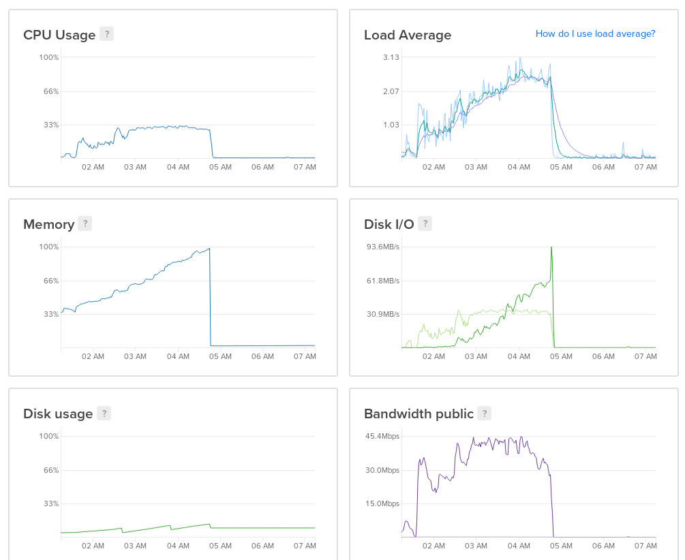

[Blockbook](https://github.com/trezor/blockbook) is a blockchain indexer that
is [almost identical](https://gist.github.com/christroutner/ff1af0ee4f5a207571fe7857acdc916e) to
Insight API. It is maintained by Trezor, the maker of hardware wallets.
The fact that it is open source, is a REST API, has a good reputation,
and Trezor has a clear
financial reason to maintain the software, makes this project stand out from
all the other options.
I'm currently exploring the use of this indexer, including as a
replacement for the unwieldy Insight API.

Indexers are needed because full nodes do not keep track of addresses. Full nodes
only keep track of transactions and blocks. But use cases often require
the ability to
query balances at an address, UTXO, or other types of metadata. This is the service
an indexer provides.

- [docker-ubuntu-blockbook](https://github.com/christroutner/docker-ubuntu-blockbook) is
the Docker container I've built to run the latest copy of Blockbook for Bitcoin
Cash. It requires a fully synced BCH full node with RPC interface, and works
with this [Dockerized full node](https://github.com/christroutner/docker-abc).

- This Docker container is also targeted for Ubuntu 18.04 running on an amd64
architecture. If you want to run it on a different architecture, you'll have
to modify [my fork for Blockbook](https://github.com/christroutner/blockbook)
to generate the `.deb` installation files for Bitcoin Cash.

## Gotchas

Here are my notes while working with this software:

- **Blockbook is a memory hog**: At the bottom of this page is a screen shot of a
Digital Ocean droplet running Blockbook. This is an $80/month Droplet with
16GB or RAM. You can see the memory
profile reaches 100% then crashes. I tried it three times with 20 workers,
10 workers, 5 workers, then 3 workers, all with the same result. Each time
Blockbook crashed around block 345000, and the crash corrupted the database,
requiring me to start all over again.   
Even at 1 thread, Blockbook still maxed out the memory and regularly crashed due
to running out of memory. However, I set the Docker container to auto-restart,
and running it single-threaded prevented the database from getting corrupted.

- **Blockbook should be run single-threaded**: Blockbook indexes with many threads,
which is (theoretically) efficient, but running multiple threads will corrupt the
database when it crashes. When this happens, the user is forced to start resyncing
from scratch, which is expensive and incredibly frustrating. Single thread
operation is set with the flag `-workers=1`. This makes the indexing process
much longer, but also prevents the threat of a corrupted database.

- A fully synced database will take up about **130 GB** of disk space.

