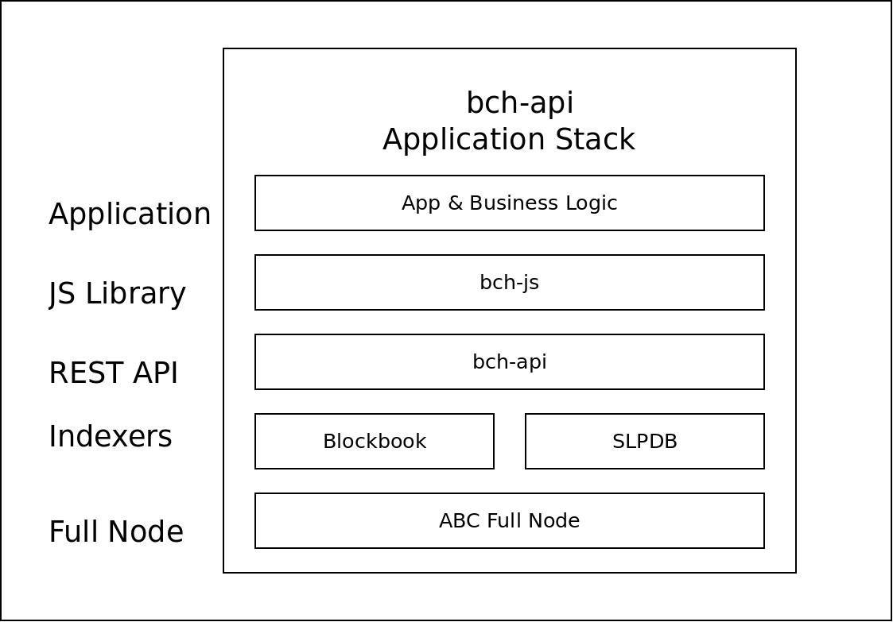

This is a guide to becoming a Bitcoin Cash (BCH) full stack developer. It's a deep rabbit hole and a long journey to mastering the full stack of BCH software, to make modern web and mobile apps that speak directly to the blockchain. But first, lets start with the most basic question: What *is* a BCH full stack developer? What does that term even *mean*?

## What is a BCH full stack developer?
Let's start with a couple definitions:

- **Developer**: A person who writes software. Because the world of software is so large, most developers will distinguish themselves by picking a specific programming like JavaScript, Python, Java, or C#.

- **Full Stack**: Developers will typically specialize in *front end* development (like phone apps, web apps, or other things with a user interface (**UI**)) or *back end* development (web servers, desktop applications, anything not involving a user interface). A full stack developer is one who is proficient at both.

Let's start with the end goal and work backwards from there: A BCH full stack developer with the skills that businesses are willing to pay good money for can build a wallet application or some other application that talks directly to the BCH blockchain. It can reliably receive and send transactions. They are able to run and maintain the infrastructure required to support that application.

<u>This guide will give you a road map to acquiring the skills necessary to become a JavaScript BCH full stack developer.</u>

### Dipping your toes in the water
Before digging into the nitty-gritty back end infrastructure, it's often encouraging to 'skip ahead' to the end and show yourself why you're about to work so hard to learn all that infrastructure. Here are some examples of popular front end applications. Each of these apps use back end infrastructure that this article will show you how to set up.

- [Badger Wallet](https://badger.bitcoin.com/) is really two wallet apps. One is for smart phones and the other is for web browsers. But they function the same. This is one of the leading wallets for working with [SLP tokens](https://simpleledger.cash/).

- [Memo](https://memo.cash/) is a clone of Twitter, but uses the BCH blockchain. Because its based on the blockchain, there can be no deplatforming or censorship of any kind.

- [Honest](https://honest.cash/v2/) is a blogging platform similar to [Medium](https://medium.com/). After writing an article, authors can embed the article into the BCH blockchain, so that it can never be deleted or censored.

- [Satoshi Dice](https://www.satoshidice.com/) is a very simple gambling game that lets you bet with BCH. Because is uses the BCH blockchain, all bets and payouts are publicly transparent and the game is [provably fair](https://www.satoshidice.com/fair).

<u>This wide range of applications all use the same common back end infrastructure.</u>

## The Full BCH Stack
The diagram below illustrates the stack of software required to build applications like the ones above. The end-user application that are linked to above would make up the top-most layer of the stack.

Here is a description of each layer, starting at bottom and working up to the top:

- **Full Node** - The full node is a the most fundamental piece of software in Bitcoin. This is an 'non-pruned' or 'archival' node that contains a full copy of the blockchain.

- **Indexers** - Indexers are like small search engines. They communicate with the full node and crawl the blockchain data to create databases that contain additional metadata that is not directly accessible from the full node.

- **REST API** - A REST API web server provides an interface for web applications to communicate inderectly with the indexers and full node. This layer provides a common interface for modern software (like web and mobile apps) to speak to the blockchain.

- **JavaScript Library** - A JavaScript library like [bitbox-sdk](https://github.com/Bitcoin-com/bitbox-sdk) or [bch-js](https://github.com/christroutner/bch-js) provides an easy way to communicate with the REST API layer. It also contains utility software for common things like generating transactions, creating wallets, and signing messages.

- **Applications** - Finally, the application layer is where the magic happens. This is the user interface that end-users get to interact with. This is the layer where front end developers play. The examples listed in the last section all fit into this layer.

This entire software stack can be run on a modern computer with 16-32 GB of RAM, 1 TB of hard drive space, and a decent internet connection.

<u>I'll explore each layer in more detail in the sections below.</u> I'll also link to Docker containers for running each layer of the stack.

### Skipping the back end
To help front end developers get started quickly, and to remove the burden of hosting your own back end infrastructure, there are a growing list of cloud service providers. This provides convenience at a price.

Trusting a service provider to handle the back end infrastructure for you is convenient, but if their servers go down, your app goes down with them. And unless you run your own fall-back infrastructure, you have no recourse but to simply wait until they get back up and running. This is known as **platform risk**. *The only way to eliminate platform risk is to run your own infrastructure.*

Here are a few of the cloud-based REST APIs for interacting with the BCH network:

- [rest.bitcoin.com](https://rest.bitcoin.com) is probably the most popular REST API for interacting with the BCH blockchain. [bitbox-sdk](https://github.com/Bitcoin-com/bitbox-sdk) is a JavaScript library that provides easy endpoints for working with rest.bitcoin.com and provides additional important tools for working with Bitcoin Cash. Documentation for both can be found at [developer.bitcoin.com](https://developer.bitcoin.com/).

- [account.bchjs.cash](https://account.bchjs.cash) is a pay-to-play version of rest.bitcoin.com that is accessed through [api.bchjs.cash](https://api.bchjs.cash). [bch-js](https://www.npmjs.com/package/@chris.troutner/bch-js) is a fork of bitbox-sdk that is designed to work with api.bchjs.cash.

- [bloq.cloud](https://bloq.cloud/) and [Block Cypher](https://www.blockcypher.com/) are a pay-to-play REST API with similar access as the above, but different structures to their REST API.

<u>There are very few free or paid REST API services for working with BCH.</u> This article will outline the steps you can take to run your own cloud infrastructure, to earn BCH as illustrated in this video:

<iframe width="600" height="400" src="https://www.youtube.com/embed/oFa8Q2OCSaw" frameborder="0" allow="accelerometer; autoplay; encrypted-media; gyroscope; picture-in-picture" allowfullscreen></iframe>

## Running a Full Node
The full node is the most fundamental piece of software. To run a full node, you'll need enough hard drive space to store the blockchain. This is currently under 200GB, but it's always growing. You'll also need at least 2 GB of RAM. Syncing a full node can take anywhere from 2 days to 2 weeks, depending on your hardware and internet connection. It's also possible to [purchase a hard-drive with a pre-synced full node](https://bchjs.cash).

There are several full node implementations. Here are a few:
- [ABC](https://www.bitcoinabc.org/) has the majority of market share. Its the implementation that started the BCH fork, and is most widely used by exchanges and miners.
- [BU](https://www.bitcoinunlimited.info/download) is the second most popular Bitcoin Cash implementation.
- [BCHD](https://bchd.cash/) is a rapidly growing, developer-friendly implementation written in Go.
- [Flowee the Hub](https://flowee.org/) is a one of the newest implementations on the scene.

This article only focuses on the ABC implementation of Bitcoin Cash. I maintain a Docker container for running a full node. Installation instructions can be found in the [GitHub repository for docker-abc](https://github.com/christroutner/docker-abc).

## Indexers
As mentioned at the beginning of this article, indexers are like little search engines that crawl the blockchain and stitch together metadata that is not directly available from the full node. The two most important features that an indexer provides for wallet or other applications is:

- BCH balance lookup by address
- [UTXO](https://developer.bitcoin.com/mastering-bitcoin-cash/4-transactions/) lookup by address

A couple widely used, open source indexers are:

- [Blockbook](/research/bitcoin-cash/blockbook)
- [Bitcore Node](/research/bitcoin-cash/bitcore-node-insight-api)

A few up-and-coming indexers include:

- [BCHD](https://bchd.cash/) has indexing capabilities via its startup options and its gRPC interface.
- [Flowee Indexer](https://flowee.org/) a new, experimental indexer.

### SLP tokens
The [Simple Ledger Protocol](https://simpleledger.cash/) uses an indexer to validate token transactions. SLP tokens are one of the newest, most popular protocols that ride on top of Bitcoin Cash. Each SLP token is a 'colored' UTXO. Token transactions are tracked using OP_RETURN data in transactions. The indexer follows the trail of transactions to track token balances.

My [Dockerized SLPDB](https://github.com/christroutner/docker-slpdb) includes [SLPDB](https://github.com/simpleledger/SLPDB), a Mongo database, and the API front end, [slpserve](https://github.com/simpleledger/slpserve). It's the complete package for interfacing to the SLP token world.

## REST API
The REST API is the communication interface that lets modern web and mobile apps talk to the blockchain. It's a lightweight webserver that wraps the indexers and full node in a REST API. This allows high level applications to talk to low-level interfaces.

<iframe width="600" height="400" src="https://www.youtube.com/embed/o0FfW5rZPFs" frameborder="0" allow="accelerometer; autoplay; encrypted-media; gyroscope; picture-in-picture" allowfullscreen></iframe>

Some of the REST API services that exist:

- [rest.bitcoin.com](https://rest.bitcoin.com) is an extension of [developer.bitcoin.com](https://developer.bitcoin.com).
- [bch-api](https://api.bchjs.cash) runs [bch-api](https://github.com/christroutner/bch-api), my personal fork of rest.bitcoin.com, which I use to try new ideas and solicite advice from the developer community.

I have not tried out these other REST APIs, but they look interesting:
- [bloq.cloud](https://bloq.cloud/)
- [Block Cypher](https://www.blockcypher.com/)
- [Blockchain.com](https://www.blockchain.com/api)

## JavaScript Libraries
[bitbox-sdk](https://www.npmjs.com/package/bitbox-sdk) is one of the most popular JavaScript libraries for working with Bitcoin Cash. You can look at [the documentation](https://developer.bitcoin.com/bitbox/docs/getting-started) and browse all the Classes. Not only does it provide an easy interface to the REST API, it includes a complete toolbox of commonly needed methods when working with Bitcoin. Browse [simple example apps](https://github.com/Bitcoin-com/bitbox-sdk/tree/master/examples) to learn how to code with it quickly.

[slp-sdk](https://www.npmjs.com/package/slp-sdk) is a superset of bitbox-sdk. It contains all the functionality of bitbox-sdk, plus the ablility to work with SLP tokens. It also has [examples](https://github.com/Bitcoin-com/slp-sdk/tree/master/examples) and [documentation](https://developer.bitcoin.com/slp/docs/js/getting-started).

I maintain my own fork of bitbox-sdk called [bch-js](https://www.npmjs.com/package/@chris.troutner/bch-js), which has its own [examples](https://github.com/Permissionless-Software-Foundation/bch-js-examples) and [documentation](https://bchjs.cash/bch-js/index.html). It contains some additional functionality, like:
- Interfacing with the [OpenBazaar Indexer](https://bchjs.cash/bch-js/index.html#api-OpenBazaar)
- Works with [SLP tokens](https://bchjs.cash/bch-js/index.html#api-SLP) natively (no external libraries).
- Includes endpoints for [Blockbook](https://bchjs.cash/bch-js/index.html#api-Blockbook) and [Bitcore](https://bchjs.cash/bch-js/index.html#api-Bitcore) indexers.

## Applications
